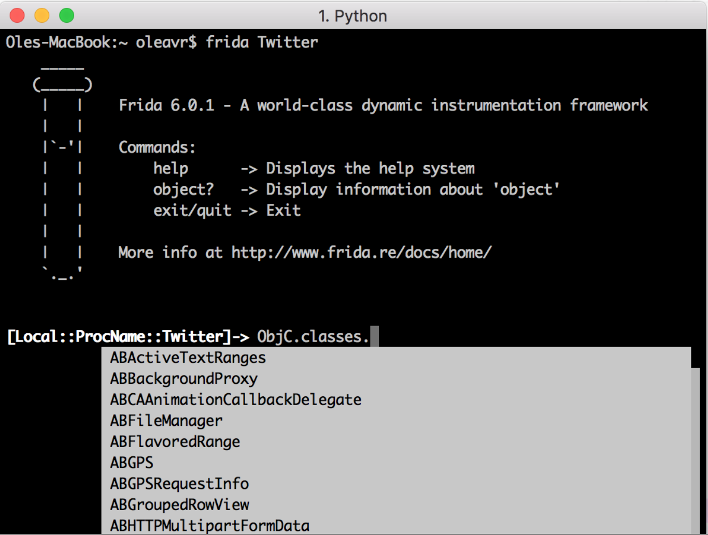
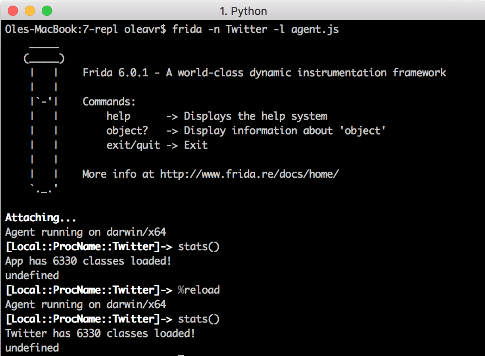

## 说起APP，我们同样有一个REPL（交互式解释器环境）来用

## 有个REPL，脚本跑起来就得心应手了

## 卸载iOS APP
```javascript
'use strict’;
const LSApplicationWorkspace = ObjC.classes.LSApplicationWorkspace;
const onProgress = new ObjC.Block({
  retType: 'void’,
  argTypes: ['object'],
  implementation: (progress) => {
    console.log('onProgress: ' + progress);
  }
});
function uninstall(appId) {
  const workspace = LSApplicationWorkspace.defaultWorkspace();
  return workspace.uninstallApplication_withOptions_usingBlock_(appId, null, onProgress);
}
```
```bash
$ frida –U SpringBoard –l agent.js
```
## 与OC交互
* ObjC.available--运行时是否可用？
* new ObjC.Object(ptr(‘0x1234’))--和位于0x1234地址的对象交互
* ObjC.classes--所有加载的类
	* Object.keys(ObjC.classes) 列出名字
	* if (‘UIView’ in ObjC.classes) 检测类是否存在
* ObjC.protocols--所有加载的协议
* [NSURL URLWithString:foo relaMveToURL:bar]转化为ObjC.classes.NSURL.URLWithString_relaMveToURL_(foo, bar) 
* NSURL[‘- setResourceValues:error:’] 从当前的类中访问其实例方法
* 向.implementation赋值来替换方法实现
* ObjC.choose() --扫描堆内存搜索OC类的实例

