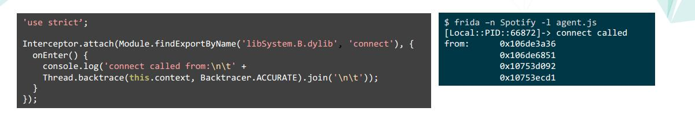
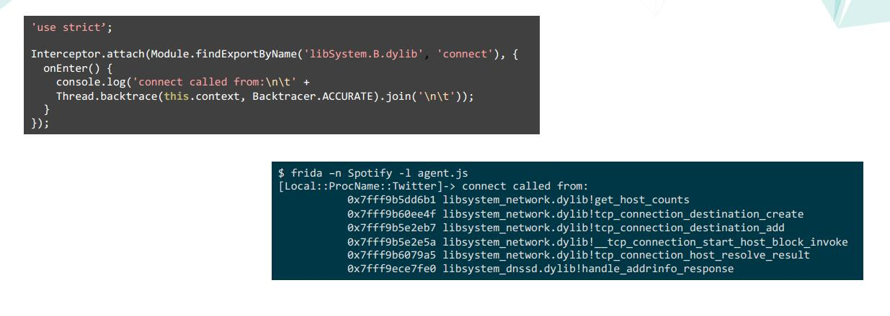

怎么处理孵化的子进程
1. device.on(‘spawned’,	on_spawned)	
2. device.enable_spawn_gaMng()	
3. device.enumerate_pending_spawns()	
例子：
https://gist.github.com/oleavr/ae7bcbbb9179852a4731

只能在Android和ios系统上运行。

堆栈回溯信息

带调试符号的堆栈回溯信息

最好的实践方法
使用nodejs去绑定frida后加载你的agent.js脚本
你可以:

•将脚本拆分为多个文件

•使用来自社区的frida模块

•从npm中调用数千个模块

•使用es6功能编写现代javascript - frida支持它

•repl适合于用- l和% reload进行原型设计
