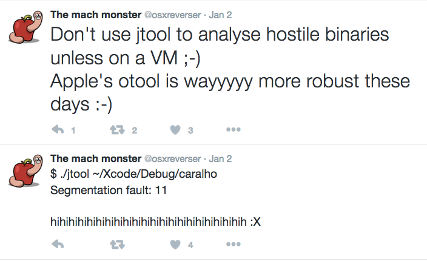

常见问题

这是开源吗？免费，是的但不是开源，我的另一个工具Dextra（Android）也不是。

为什么不开源？Hopper？IDA？我在一个很好的公司:-) jtool从简单的otool -l开始，但当我开始做反汇编时，事情变得无法控制。jtool里面有很多我自己写的原创代码，如果我给了任何一种许可，其他人都可能不会遵守，而且用了代码连致谢也没。抱歉。我在这里吐点苦水，但它仍然是免费的，可以说这超过了大多数工具（当然otool）。

我可以写插件吗？更好。您可以使用shell命令来编写它（它被设计为grep（1）和其他过滤器友好），您可以用jtool的逻辑编写整个程序 -  machlib和disarm - 作为dylibs。

关于颜色，为什么当使用管道时颜色会被禁用，而且当JCOLOR = 1并且使用管道时，它乱套了？ 因为颜色是通过via curses完成的。 当您不使用管道时（即jtool检测到stdout是一个tty），这是默认值，当您禁用此功能时，除非您坚持这么做（JCOLOR = 1或导出...）。 但是如果你这么做，那么尽可能少用-R（这个很多的）去处理序列。 或者尝试--html进行彩色化，您可以把超链接的HTML输出保存到文件。
 
关于ARM32/Thumb？虽然反汇编器原来是32，但渐渐的在理智和支持ARM32/Thumb之间，我选择了前者。这样我可以有时间为大家写其他的工具和书籍。 jtool在arm能工作，但是没有官方支持，arm64有而且很全面（不是FP/SIMD，只有SpringBoard和其他几个守护进程使用，如果我闲了几个小时在没有互联网也没有别的事情做，我会在某个时候得到这个）。更新：ARMv7k回来了

为什么不使用foundstone或其他反汇编框架？因为那就不是Jtool了？:-)代码是100％是我原创的，没有使用任何开源或者闭源的其他代码（除了系统的include文件）

我们如何帮助改进？提出改进，要求增加功能，或者在OS X Book Forum上报告错误

我们做什么是帮倒忙？
遇到崩溃时，您在Twitter上发牢骚

或者您在没有阅读手册页的情况下就说jtool在某些情况下会崩溃，您还是去使用otool吧，但是苹果公司使用objdump来重写它破坏了它的优点。讲真，如果你在使用jtool时候崩溃了，告诉我，我会去修正。抱怨没有用，这是JTOOL中的绝对逻辑，所以哇啦，它不是完美的。但它免费，又不用使用狗屎一样的otool。 我不期待谢谢，但只是砰击工具，甚至不报告错误和傻逼没什么区别。

1.0版本什么时候发布？跟MOXiI 2.0一起

那MOXIiI2.0什么时候发布？2017年7月

在那之前我们干点啥？额，撸一发？ 使用OS X Book Forum来问我什么？ 或者到Technologeeks的OS X/iOS培训课程？