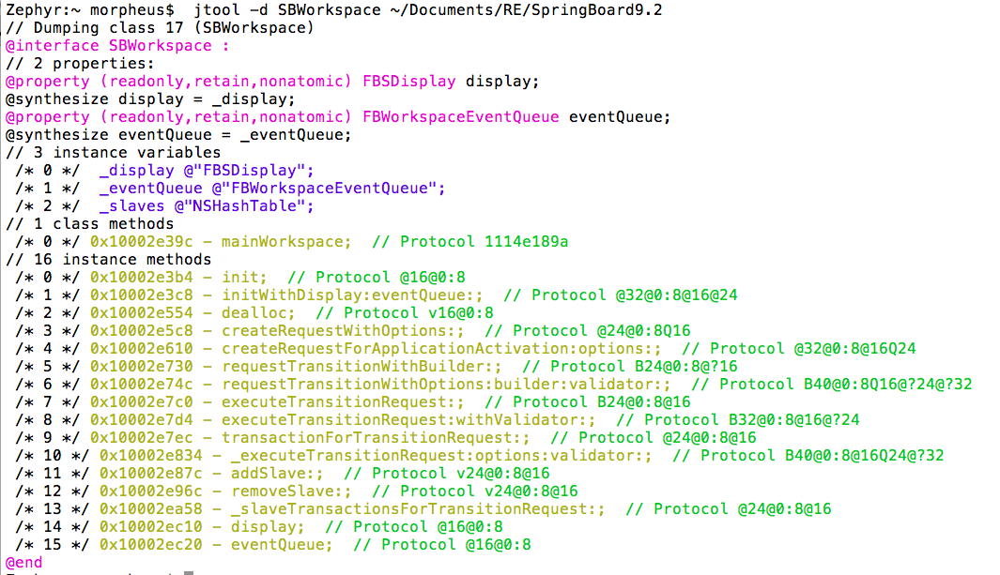
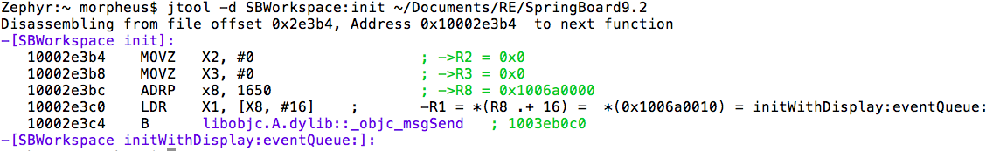
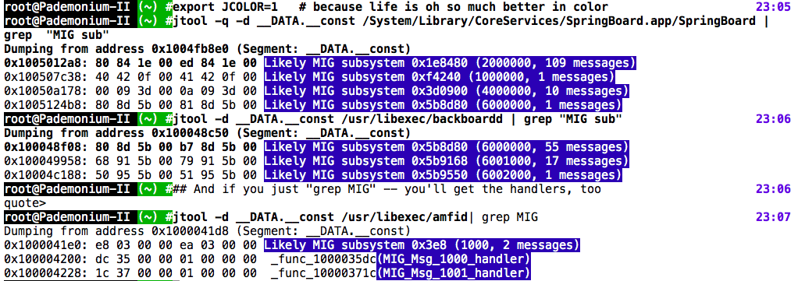
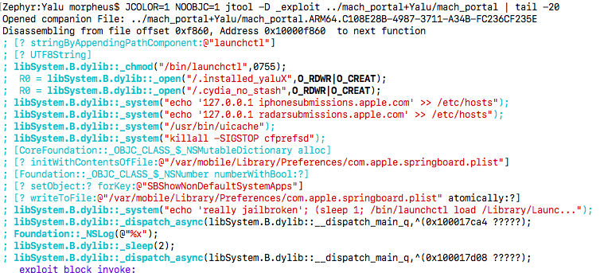
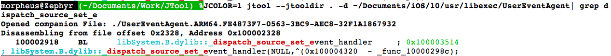
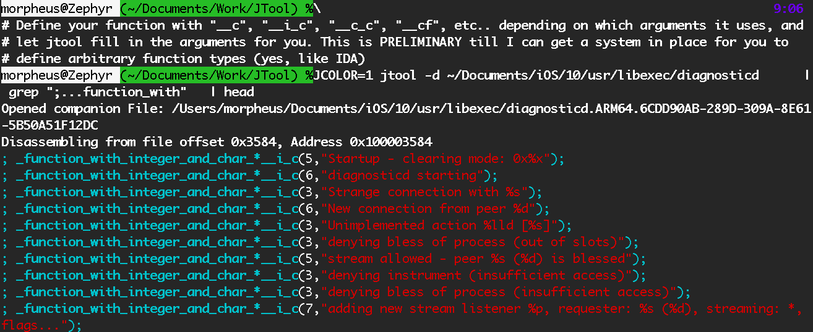
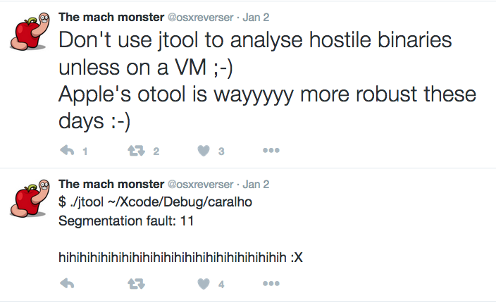

# jtool - Taking the O out of otool(1)


## 这是什么？

jtool命令是一个比otool功能更完善的工具，添加了许多Mach-O相关的命令，如atos（1），dyldinfo（1），nm（1），segedit（1）， pagestuff（1），string（1），甚至codesign（1）和非正式的ldid。 jtool还提供了许多新颖的功能，如二进制搜索功能，符号注入和反汇编功能（有限但不断改进）。 它还提供带有颜色的输出。 最重要的是，它可以在各种平台上运行 - **OS X，iOS甚至Linux** 。 使用任何一个都是**免费**的，最新版本可以在[这里](http://www.newosxbook.com/tools/jtool.tar)找到。

虽然jtool是围绕我自己的用例构建的，但其他人也发现它很有用。 它支持的选项也已经增加了许多。 随着MOXiI 2的发布（即将推出），我终于发布jtool（几乎）1.0版本，并且以示例的形式记录了它的无数功能，其中一些可能比较难理解。 运行jtool，不带任何参数，将显示所有的选项，我意识到这是一个恐怖的事情：

```
This is jtool v(almost 1.0) (Moscow) - with partial ARMv7k disassembly and SLC symbol resolution, compiled on Jan  8 2017 20:33:01

Usage: jtool [options] _filename_

OTool Compatible Options:
   -arch ..            	For fat (universal) binaries: i386,x86_64[h], arm[v[67]]
   -h                  	print header (ELF or Mach-O)
   -f                  	print fat header
   -l                  	List sections/commands in binary
   -L                  	List shared libraries used (like LDD)
   -v[v]               	Verbose output. -vv is even more verbose. -vvv might be more than you can handle :-)

New Options:
   --pages             	Show file page map (similar to pagestuff(1))
   -a _offset_         	Find virtual address corresponding to file offset _offset
   -e[xtract] _name_   	Extract section/segment _name_ in binary, or file _name_ from shared cache
   -e[xtract] arch     	Extract selected architecture from FAT file. Specify arch with -arch .. or ARCH=
   -e[xtract] signature	Extract code signature from binary
   -F [_string_]       	find all occurrences of _string_ in binary
      -Fs _string_     	also show search results (experimental)
   -S                  	List Symbols (like NM)
      -Sa _address_ _symbolname_	Add symbolname manually for address (to .jtool)
      -Sd _symbolname_ (not yet)	Remove symbolname for address (to .jtool)
   -p _addr_[,_size_]  	Peek at _size_ bytes in virtual _address_ in binary (like OD, but on memory)

dyldinfo Compatible Options:
   -bind               	print addresses dyld will set based on symbolic lookups
   -lazy_bind          	print symbols which dyld will lazily set on first use
   -weak_bind          	print symbols which dyld must coalesce
   -export             	print addresses of all symbols this file exports
   -opcodes            	print opcodes used to generate the rebase and binding information
   -function_starts    	print table of function start addresses
   -data_in_code       	print any data-in-code inforamtion

Destructive Options (will write output to /tmp):
   -m                  	Modify
     __SEGMENT[.__section],[_offset][,size]	(null)
   -r                  	Remove/Resize (Experimental)
     -rL _dylib/soname_      	Library
     -rC _Load_Command_#_    	Load Command
   -/+pie              	Toggle Position Independent Executable (ASLR)
   -/+lcmain           	Toggle pre-Mountain-Lion/iOS6 compatibility (LC_UNIXTHREAD/LC_MAIN)
   -/+enc              	Mark as decrypted/encrypted (toggles cryptid of LC_ENCRYPTION_INFO[64])

Disassembly/Dump Options:
   -d[_arg_[,size]]    	disassemble/dump (experimental) -  _arg_ may specify address/section/symbol/Obj-C class. size is optional
     -dA [_arg_[,size]]	Disassemble as ARM code (32-bit instructions)
     -dT [_arg_[,size]]	Disassemble as Thumb/Thumb-2 code (16/32-bit instructions)
     -dD [_arg_[,size]]	Dump (even on a text segment)
     -do [_arg_[,size]]	Dump/Disassemble from offset, rather than address
     -d objc           	Dump objective-C classes in binary, if any
   -D : As -d, but attempts to decompile only (i.e. shows only C-level code, no disassembly	(null)
   -opcodes            	Also dump opcode bytes
   --jtooldir _path_   	path to search for companion jtool files (default: $PWD).
			Use this to force create a file, if one does not exist

Code Signing Options:
   --sig               	Show code signature in binary (if any)
   --sign [adhoc]      	self-sign with no certificate
   --ident _ident_     	provides identity (fake, of course)
   --appdir            	Set App Path (for code signing and/or verification)
   --ent               	Show entitlements in binary (if any)

Advanced Options:
   --pcrelative        	show addresses as PC relative offset
   --slide  _slide_    	slide text by _slide_ bytes (may be negative)
   --rebase _address_  	rebase text to this address (destructive)
   --inplace           	Perform destructive operations in place (instead of out.bin) for the brave
   --version           	Show tool version and compilation date

Output Options:
   --html              	Output as HTML (implies color)
   --curses            	Output as Color using ncurses (can also set JCOLOR=1)

Environment variables: JDEBUG=1, NOPSUP=1 (suppress NOPs in disassembly), NOOBJC=1 (avoid Obj-C crashes)

Note: Experimental features may not be available in public version of this tool
```

所以让我们逐个去说明每一个选项。


**重要提示**：Jtool已经过全面的测试，但我仍然需要依靠你的错误报告来解决JTool中的bug。 如果你有一个JTool很难解析的二进制，或者如果它引起了JTool的崩溃，**请告知我**。 我不能修复我不知道的错误..遇到问题，你可以尝试使用NOOBJC = 1再次运行jtool，来禁用OBJC支持（这部分功能可能还有bug）。

jtool有很多有用的功能，我不能把它们全部放在man页面中。 真的，没有人读这个（因为你必须将jtool.1移动到/usr/share/man/man1）。 所以我最后发布了一个像样的HTML文档。 这个文档正在逐渐丰富，但是目前还没有覆盖所有功能。

## 文档的目录

- Otool兼容选项
- dyldinfo兼容选项
- 高级选项：
   - pages（获取布局）
   - -a（查找地址）
   - -S
- 代码签名选项
   - --sig
   - --ent
   - --sign
- Objective-C支持
- 补充的一些很酷的选项


##  Otool兼容选项

当我使用jtool时，我认为我可以使jtool替代otool,所以一些选项实际上是一样的。这些参数包括-L(显示依赖的库，和ldd相似)，-f(获取FAT头)。其他参数也是兼容的，但有些区别。例如：-h Mach-O 头，会打印出很多详细信息，不会只是一行：

```
	Zephyr:~ morpheus$ otool -h /bin/ls
	/bin/ls:
	Mach header
	      magic cputype cpusubtype  caps    filetype ncmds sizeofcmds      flags
	 0xfeedfacf 16777223          3  0x80           2    19       1816 0x00200085
	
	Zephyr:~ morpheus$ jtool -h  /bin/ls
	Magic:	64-bit Mach-O
	Type:	executable
	CPU:	x86_64
	Cmds:	19
	size:	1816 bytes
	Flags:	0x200085
```

我更偏爱jtool的原因就是它对grep的支持更友好，所以你能分离出包含你想要属性的行。在最常见的选项-l，然而，他只是将otool的多行输出变得行数更少,显示结果更友好：

```
	$ otool -l /bin/ls                $ jtool -l /bin/ls
	/bin/ls:
	Load command 0                    LC 00: LC_SEGMENT_64          Mem: 0x000000000-0x100000000      __PAGEZERO
	      cmd LC_SEGMENT_64           LC 01: LC_SEGMENT_64          Mem: 0x100000000-0x100005000      __TEXT
	  cmdsize 72                             Mem: 0x100004430-0x100004604            __TEXT.__stubs  (Symbol Stubs)
	  segname __PAGEZERO                     Mem: 0x100004430-0x100004604            __TEXT.__stubs  (Symbol Stubs)
	   vmaddr 0x0000000000000000             Mem: 0x100004920-0x100004b10            __TEXT.__const  
	   vmsize 0x0000000100000000             Mem: 0x100004b10-0x100004f66            __TEXT.__cstring        (C-String Literals)               
	  fileoff 0                              Mem: 0x100004430-0x100004604            __TEXT.__stubs  (Symbol Stubs)
	 filesize 0                        LC 02: LC_SEGMENT_64          Mem: 0x100005000-0x100006000      __DATA
	  maxprot 0x00000000                         ....
	 initprot 0x00000000
	   nsects 0
	    flags 0x0
	Load command 1
	      cmd LC_SEGMENT_64
	  cmdsize 552
	  segname __TEXT
	   vmaddr 0x0000000100000000
	   vmsize 0x0000000000005000
	  fileoff 0
	 filesize 20480
	  maxprot 0x00000007
	 initprot 0x00000005
	   nsects 6
	    flags 0x0
```


otools的输出简单的可怕，因为它是稀疏地分散到多个行。jtool聚集这些信息使你更清楚的看到那些重要信息，并减少了滚屏的页面。另一个好处是使用grep：

```
	# Finding details about a segment with otool(1):
	Zephyr:~ morpheus$ otool -l /bin/ls | grep LC_SEGM
	      cmd LC_SEGMENT_64
	      cmd LC_SEGMENT_64
	      cmd LC_SEGMENT_64
	      cmd LC_SEGMENT_64
	# Really helpful, right? Yes, you could do that with grep -A, but I find this simpler: 
	Zephyr:~ morpheus$ jtool -l -v /bin/ls | grep LC_SEGM
	LC 00: LC_SEGMENT_64          Mem: 0x000000000-0x100000000	File: Not Mapped	---/---	__PAGEZERO
	LC 01: LC_SEGMENT_64          Mem: 0x100000000-0x100005000	File: 0x0-0x5000	r-x/rwx	__TEXT
	LC 02: LC_SEGMENT_64          Mem: 0x100005000-0x100006000	File: 0x5000-0x6000	rw-/rwx	__DATA
	LC 03: LC_SEGMENT_64          Mem: 0x100006000-0x100009000	File: 0x6000-0x8750	r--/rwx	__LINKEDIT
```


注意上述使用了那个冗长的（LC_SEGMENT 命令）-v。

一般的（FAT）文件，JTool提供相同的 -arch 开关来选择详细的架构。有几种不同otool：


- jtool拒绝接触一个fat二进制文件，除非你指定架构
- 你可以用 -arch 指定架构，也可以使用环境变量  ARCH= 。所以设置默认值非常有用。
- 可以用数字指定架构

毕竟最后一个选项貌似不常见，FAT能有多少种架构？嗯，好吧，我也思考过这个问题，直到太极的8.4越狱出现，不仅出现了26-27的架构，而且同时使用，因为otool只能匹配第一个，导致otool会混乱。但jtool可以指定一个架构，避免这种错误。（ [我的文章](http://www.newosxbook.com/articles/28DaysLater.html#codesigning) 里有举例）

## dyldinfo兼容选项

dyldinfo 在探索苹果内部动态装载程序的过程中非常有用。但他不适用于iOS。jtool能够使用大多数dyldinfo的选项，并且可以仿效“busybox-style”，如果你象征性地链接dyldinfo，调用他：

```
Zephyr:~ morpheus$ ln -s `which jtool` /tmp/dyldinfo
Zephyr:~ morpheus$ !$
/tmp/dyldinfo
Usage: dyldinfo [-arch <arch>] <options> <mach-o file>
-dylibs           print dependent dylibs
-rebase           print addresses dyld will adjust if file not loaded at preferred address
-bind             print addresses dyld will set based on symbolic lookups
-weak_bind        print symbols which dyld must coalesce
-lazy_bind        print addresses dyld will lazily set on first use
-function_starts  print table of function start addresses

# Call jtool with some dyldinfo option:
Zephyr:~ morpheus$ /tmp/dyldinfo -bind /bin/ls
bind information:
segment section          address        type    addend dylib            symbol
__DATA  __got            0x100005000    pointer      0 libSystem.B.dylib    __DefaultRuneLocale
__DATA  __got            0x100005008    pointer      0 libSystem.B.dylib    ___stack_chk_guard
__DATA  __got            0x100005010    pointer      0 libSystem.B.dylib    ___stderrp
__DATA  __got            0x100005018    pointer      0 libSystem.B.dylib    ___stdoutp
__DATA  __got            0x100005020    pointer      0 libSystem.B.dylib    _optind
__DATA  __nl_symbol_ptr  0x100005028    pointer      0 libSystem.B.dylib    dyld_stub_binder
# Call the real binary:
Zephyr:~ morpheus$ dyldinfo -bind /bin/ls
bind information:
segment section          address        type    addend dylib            symbol
__DATA  __got            0x100005000    pointer      0 libSystem        __DefaultRuneLocale
__DATA  __got            0x100005008    pointer      0 libSystem        ___stack_chk_guard
__DATA  __got            0x100005010    pointer      0 libSystem        ___stderrp
__DATA  __got            0x100005018    pointer      0 libSystem        ___stdoutp
__DATA  __got            0x100005020    pointer      0 libSystem        _optind
__DATA  __nl_symbol_ptr  0x100005028    pointer      0 libSystem        dyld_stub_binder
# Show weak binds: (Thanks Guhyeon)
Zephyr:~ morpheus$ jtool -weak_bind /usr/sbin/weakpass_edit  
bind information:
segment section          address    index  dylib            symbol
__DATA  __la_symbol_ptr  0x100003040           this-image    __ZdlPv
__DATA  __la_symbol_ptr  0x100003048           this-image    __Znwm

```
自从jtool基本上1：1模仿dyldinfo，引用了后者的man page的详细页。我最常使用的选项是 -function_starts, -bind and -lazy_bind。


## 新的选项（New Options）

#### --pages
您可能用过pagestuff命令，该命令能导出Mach-O二进制文件的内存页布局。语法略奇怪，将文件名作为第一个参数，有点粗糙。

```
$ pagestuff ~/Documents/iOS/JB/Pangu9/pguntether -a | more
File Page 0 contains fat file headers
File Page 1 contains empty space in the file between:
    fat file headers and
    Mach-O file for armv7
...
File Page 8 contains empty space in the Mach-O file for armv7 between:
    Mach-O headers and
    contents of section (__TEXT,__text)
File Page 9 contains contents of section (__TEXT,__text) (armv7)
Symbols on file page 9 virtual address 0x91f8 to 0xa000
... this little piggy went to the river...
```

jtool  --pages 选项能够提供更清晰的输出

```
# Cut to the chase:
Phontifex-Magnus:~ root# ARCH=arm64 jtool --pages /pguntether
0x0-0x38000	__TEXT
0x53e8-0x34f50	__TEXT.__text
0x34f50-0x35490	__TEXT.__stubs
0x35490-0x359e8	__TEXT.__stub_helper
0x359e8-0x36a11	__TEXT.__const
0x36a11-0x379cf	__TEXT.__cstring
0x379cf-0x37e30	__TEXT.__objc_methname
0x37e30-0x37e64	__TEXT.__gcc_except_tab
0x37e64-0x37ffc	__TEXT.__unwind_info
0x38000-0x3c000	__DATA
0x38000-0x38048	__DATA.__got
0x38048-0x383c8	__DATA.__la_symbol_ptr
0x383d0-0x38530	__DATA.__const
0x38530-0x389d0	__DATA.__cfstring
0x389d0-0x389d8	__DATA.__objc_imageinfo
0x389d8-0x38b80	__DATA.__objc_selrefs
0x38b80-0x38bd8	__DATA.__objc_classrefs
0x38bd8-0x3b99c	__DATA.__data
0x3c000-0x3f120	__LINKEDIT
0x3c000-0x3c030	Rebase Info     (opcodes)
0x3c030-0x3c2d8	Binding Info    (opcodes)
0x3c2d8-0x3cb98	Lazy Bind Info  (opcodes)
0x3cb98-0x3ce70	Exports                  
0x3ce70-0x3d008	Function Starts
0x3d008-0x3d080	Code Signature DRS
0x3d008-0x3d008	Data In Code
0x3d080-0x3dcd0	Symbol Table
0x3dcd0-0x3e074	Indirect Symbol Table
0x3e074-0x3e974	String Table
0x3e980-0x3f120	Code signature
```

#### -a


有时，您只需要快速查找某个地址在段中的偏移量，而不必在pagestuff或者jtool --pages的输出中筛选。为此jtool有一个-a选项

```
Phontifex-Magnus:~ root# ARCH=arm64 jtool -a 0x38b81 /pguntether 
Offset 38b81 in file will be loaded at 100038b81 (__DATA.__objc_classrefs)
Phontifex-Magnus:~ root# ARCH=arm64 jtool -a 0x81 /pguntether 
Requested offset 129 falls in Load Command 1 (LC_SEGMENT_64)
```

#### -S


-S选项与nm命令做同样的事情。该选项有两种形式，简单的 -S（S大写）和完整信息的-V（包括每个符号所在的dylib）。-v等同于nm中的-m。不像dyldinfo，选项不兼容。

这个选项真正有用的是快速的编写脚本，例如在多个二进制文件中寻找特定符号：


```
# If something calls SecTaskCopyValueForEntitlement, then it checks entitlements:
# (though there are other ways, like calling csops[_audittoken] directly..)
Phontifex-Magnus:/usr/libexec root# for d in /usr/libexec/* ; do  \
     if jtool -S $d 2>/dev/null | grep SecTaskCopy > /dev/null; then \
        echo $d checks entitlements...; \
     fi;  \
     done
/usr/libexec/OTATaskingAgent checks entitlements...
/usr/libexec/adid checks entitlements...
/usr/libexec/configd checks entitlements...
/usr/libexec/crash_mover checks entitlements...
/usr/libexec/demod checks entitlements...
/usr/libexec/demod_helper checks entitlements...
/usr/libexec/keybagd checks entitlements...
/usr/libexec/locationd checks entitlements...
/usr/libexec/lockbot checks entitlements...
/usr/libexec/lskdd checks entitlements...
/usr/libexec/lskdmsed checks entitlements...
/usr/libexec/mobile_obliterator checks entitlements...
/usr/libexec/mobileassetd checks entitlements...
/usr/libexec/nlcd checks entitlements...
/usr/libexec/pfd checks entitlements...
/usr/libexec/pkd checks entitlements...
/usr/libexec/rolld checks entitlements...
/usr/libexec/securityd checks entitlements...
/usr/libexec/timed checks entitlements...
/usr/libexec/transitd checks entitlements...
/usr/libexec/webinspectord checks entitlements...
```


## 代码签名选项(Code Signing Options)

代码签名选项是JTool的第二大功能。对于围绕代码签名和授权文件的iOS安全方案来说，重要的是要有一种方法来快速确定二进制文件拥有的授权以及签名的方式。OS X已经有了这样的工具，但是我发现它粗糙的多，而且还没有什么端口供iOS使用，因此jtool这样的工具就很有必要了。


#### --sig

--sig选项允许您验证或显示代码签名。无参数的情况下，它会显示签名相关的信息，并执行静默的验证：
```
Phontifex-Magnus:~ root# jtool --sig /System/Library/CoreServices/SpringBoard.app/SpringBoard
Blob at offset: 7453808 (47168 bytes) is an embedded signature
	Code Directory (36570 bytes)
		Version:     20100 					# 20100 or the older 20001
		Flags:       adhoc					# adhoc (iOS System) or none
		CodeLimit:   0x71bc70					# Code signature maximum reach
		Identifier:  com.apple.springboard (0x30)		# App/Bundle identifier
		CDHash:	     8dcf2b2e1839d86068672ac51386d6f6692eb7c4	# Code Directory Hash (calculated)
		# of Hashes: 1820 code + 5 special			# Code and special slots
		Hashes @170 size: 20 Type: SHA-1			# Offset of Hash slot 0
 Empty requirement set (12 bytes)					# Blob 1
Entitlements (10515 bytes) (use --ent to view)				# Blob 2
Blob Wrapper (8 bytes) (0x10000 is CMS (RFC3852) signature)		# Blob 3
```

和其他工具一样，jtool会更详细地输出关于子区块（特别是偏移）的更多细节以及代码段( CodeDirectory )中的每个页哈希（如果有的话，还会显示具体的slots信息)：

```
Phontifex-Magnus:~ root# jtool -v --sig /System/Library/CoreServices/SpringBoard.app/SpringBoard 
Blob at offset: 7453808 (47168 bytes) is an embedded signature of 47149 bytes, and 4 blobs
	Blob 0: Type: 0 @44: Code Directory (36570 bytes)
		Version:     20100
		Flags:       adhoc (0x2)
		CodeLimit:   0x71bc70
		Identifier:  com.apple.springboard (0x30)
		CDHash:	     8dcf2b2e1839d86068672ac51386d6f6692eb7c4
		# of Hashes: 1820 code + 5 special
		Hashes @170 size: 20 Type: SHA-1
			Entitlements blob:	52a9a55ab0c40a12e3a915bcea29d602419a21f8 (OK)
			Application Specific:	Not Bound
			Resource Directory:	c0c8a907e2663ee1dc33a137fbfb55f253bcf464 (OK)
			Requirements blob:	3a75f6db058529148e14dd7ea1b4729cc09ec973 (OK)
			Bound Info.plist:	f852d93c0a643f9d774e7d2057664d769d96d528 (OK)
			Slot   0 (File page @0x0000):	34f05f5bc893e54b69c7a3f87137f86f49a09e5d (OK)
			Slot   1 (File page @0x1000):	e515677a23b37411199258e68da4a03cd184ffae (OK)
			....
			Slot 1818 (File page @0x71a000):	e563b1335082da705a949c7c62c15c6da47876b2 (OK)
			Slot 1819 (File page @0x71b000):	496567ae0e21a025eccb859c9d2e20bacb88075d (OK)
	Blob 1: Type: 2 @36614:  Empty requirement set (12 bytes)
	Blob 2: Type: 5 @36626: Entitlements (10515 bytes) (use --ent to view)
	Blob 3: Type: 10000 @47141: Blob Wrapper (8 bytes) (0x10000 is CMS (RFC3852) signature)
```

jtool通常会自动找到具体的slots，但是如果没有，你可能需要手工指定 --appdir


#### --ent

如果你想检查一个二进制文件所声明的权限，那么你需要这个工具。和其他工具相同但更准确的是，jtool也会解析区块(blob)头：
```
Phontifex-Magnus:~ root# jtool  --ent /System/Library/CoreServices/SpringBoard.app/SpringBoard 
<!DOCTYPE plist PUBLIC "-//Apple//DTD PLIST 1.0//EN" "http://www.apple.com/DTDs/PropertyList-1.0.dtd">
<plist version="1.0">
<dict>
	<key>allow-obliterate-device</key>
	<true/>
	# ....
	<key>keychain-access-groups</key>
	<array>
		<string>apple</string>
		<string>com.apple.preferences</string>
	</array>
	<key>vm-pressure-level</key>
	<true/>
</dict>
</plist>
```
再次提醒下，你需要记住，这是用shell脚本和grep来设计的，所以你也可以做一个或者其他工具来获得所有那些苹果在使用的但是没有文档化的权限(entitlements)。（作者正在整理这些到数据库中，完成后会公开分享出来 --译者注）

#### --sign
该选项是我在内部已经使用很长时间的功能，最终才发布出来。jtool是用和Saurik's相同的方式来生成自签名二进制文件。因此，您可以指定要插入或者使用的权限文件。该工具可能导致未知的结果，一旦你使用它，就代表了你同意这个临时警告/免责声明：
```
morpheus@Zephyr (~)$  jtool --sign binary
  **************************************************************************************
  * Warning: Code signatures are still defined as Beta. Lots of minutiae to deal with, *
  * and it isn't as easy as you might think to get things right with all these hashes. *
  *                                                                                    *
  * I suggest you use --sig -v to validate your pseudo-signed binaries.                *
  * Try JDEBUG=1 if you want to follow along.                                          *
  **************************************************************************************
Warning: Destructive option. Output (397920 bytes) written to out.bin
morpheus@Zephyr ()$  ldid -S binary
morpheus@Zephyr ()$  ls -l binary out.bin
-rwxr-xr-x  1 root  staff  397920 Oct 18 03:30 binary
-rwxr-xr-x  1 root  staff  397920 Oct 18 03:30 out.bin
morpheus@Zephyr ()$  diff out.bin binary

morpheus@Zephyr ()$  echo $?
0
```
为什么会有这个警告，并且默认输出的是out.bin文件而不是替换原来的文件,原因很简单: 代码签名是有风险的，如果丢失原来的文件，很难甚至是不可恢复的。
你如果不使用内置的命令codesign(1) 或者codesign_allocate(1)，而是使用```JDEBUG=1```命令,jtool就会显示整个流程一步一步地执行的过程，你就可以看到代码签名是如何实现的：

```
morpheus@Zephyr (~)$ JDEBUG=1 ARCH=armv7 jtool  --sign --ent ent.xml  /tmp/a
Very last section ends at 0xc11c, so that's where the code signature will be
Aligning to 16 byte offset - 0xc120
Allocating Load Command
First section offset is 7ea4; Mach header size is 580
Patching header to reflect inserted command @580
Patching __LINKEDIT to reflect new size of file
Setting LC fields
Allocating code signature superblob of 669 bytes, with 3 sub-blobs..
Setting LC_CODE_SIGNATURE's blob size to match CS Blob size..
Creating Code Directory with 13 code slots and 5 special slots
Calculating Hashes to fill code slots..
Need to pad 288 bytes to page size in last page (because code signature is also in this page)
Padding to page size with 3808 bytes
Calculating (modified) last page hash
Adding empty requirements set to 447
Filling the special slot (-2) for requirements blob...
 Copying entitlements blob to 459
Filling the special slot (-5) for entitlement blob...
 Crafting New Mach-O
Inserting 669 bytes Blob at 49440, bringing new file size to 50109
Warning: Destructive option. Output (50109 bytes) written to out.bin
```

## DYLD共享缓存（DYLD Shared Caches）


苹果将​​大多数dylibs和插件预先链接到“Shared Library Cache”中。 SLC位于 /var/db/dyld（OS X）和 /System/Library/Caches/com.apple.dyld（iOS）中。 OS X 缓存也有一个“map”，但是iOS没有。

在iOS中，没有单独的dylib，它们都在缓存中。这使得缓存非常重要，并且有许多的“提取”工具。 JTool不提供全面的支持，只提供我觉得有用的东西。尤其是：

```
# Identifying a shared cache file
Phontifex-Magnus:~ root# jtool  /System/Library/Caches/com.apple.dyld/dyld_shared_cache_arm64
File is a shared cache containing 1007 images (use -l to list)
# Finding the map of a shared cache file (formerly, --map which isn't needed anymore
Phontifex-Magnus:~ root# jtool -l /System/Library/Caches/com.apple.dyld/dyld_shared_cache_arm64
File is a shared cache containing 1007 images
   0:        180028000 /System/Library/AccessibilityBundles/AXSpeechImplementation.bundle/AXSpeechImplementation
   1:        180030000 /System/Library/AccessibilityBundles/AccessibilitySettingsLoader.bundle/AccessibilitySettingsLoader
   2:        18003c000 /System/Library/AccessibilityBundles/AccountsUI.axbundle/AccountsUI
   3:        180040000 /System/Library/AccessibilityBundles/AddressBookUIFramework.axbundle/AddressBookUIFramework
   4:        180048000 /System/Library/AccessibilityBundles/CameraKit.axbundle/CameraKit
   5:        180058000 /System/Library/AccessibilityBundles/CameraUI.axbundle/CameraUI
   6:        180064000 /System/Library/AccessibilityBundles/HearingAidUIServer.axuiservice/HearingAidUIServer
   7:        180074000 /System/Library/AccessibilityBundles/MapKitFramework.axbundle/MapKitFramework
   8:        180080000 /System/Library/AccessibilityBundles/MediaPlayerFramework.axbundle/MediaPlayerFramework
...
# And the -h (header) option, I added after Pangu 9. See anyhing different, boys and girls? *hint* *hint*
Phontifex-Magnus:~ root# jtool -h /System/Library/Caches/com.apple.dyld/dyld_shared_cache_arm64           
File is a shared cache containing 1007 images (use -l to list)
6 mappings starting from 152, Mapping Count: 1007. 344 Images starting from 0
DYLD base address: 0, Code Signature Address: 25a4c000 (2f0f02 bytes)
Slide info: 1ca18000 (1a4000 bytes)
Local Symbols: 204c8000 (5584000 bytes)
mapping r--/r--    0MB        180000000 -> 180028000         (25d40000-25d68000)
mapping r-x/r-x  384MB        180028000 -> 1980a4000         (28000-180a4000)
mapping rw-/rw-   73MB        19a0a4000 -> 19ea18000         (180a4000-1ca18000)
mapping r--/r--   12MB        1a0a18000 -> 1a16b0000         (1ca18000-1d6b0000)
mapping r--/r--    0MB        1a16b0000 -> 1a16b4000         (25d68000-25d6c000)
mapping r--/r--   46MB        1a16b4000 -> 1a44c8000         (1d6b4000-204c8000)
```

Jtool可以轻松地解压cache文件，只需使用 -e dylib 选项即可提取需要的dylib。请注意，提取的dylib将大于50MB，因为JTool不会解构被合并的__LINKEDIT段。

**但是为什么需要提取dylib呢???** Jtool的一个关键功能是其他decachers没有的，就是它对于**cache中的dylib**也是有效的！这不仅可以节省您的磁盘空间，而且还可以让您看到缓存中的dylibs与其他dylib的关系（例如跨dylib调用）。要使用此功能，只需将":"作为cache和dylib名称之间的分隔符。所有的功能（例如 -l, -S等）都能正常工作，但真正有用的功能是-d。例如：

```
root@phontifexMagnus (~)# jtool -d /System/Library/Caches/com.apple.dyld/dyld_shared_cache_arm64:libMobileGestalt | more
Found but not extracting - setting File Start to 16a10000
Disassembling from file offset 0x11a4, Address 0x196a111a4 
Processing cached file from offset 16a38000  size: 25d44000
_MGSetLogHandler:
   196a111a4    ADRP   x8, 32640                ; ->R8 = 0x19e991000 
   196a111a8    STR    X0, [X8, #280]           ; *0x19e991118 = X0 ARG0
   196a111ac    RET                     
_func_196a111b0:
   196a111b0    ORR    W1, WZR, #0x1            ; ->R1 = 0x1 
   196a111b4    B      _func_196a111b8  ; 196a111b8
..
```

## Objetive-C支持

jtool现在可以识别objective-C。用“-d objc”获取一个类的列表：
这里使用-v会逆向这些类，按照classdump-Z的实现方式，但是会更详细一点并且带有颜色。你也可以指定一个类名作为-d的参数，jtool是足够智能地明白你想逆向这个类。



（是的，我知道protocol还没能解析出来。我正在研究它。）
你还能使用-d去获得一个特定的方法。为了避免使用麻烦的+/-/[/空格，你可以使用C++语法：


注意这个是通过重建那些**不在苹果官方oc库中的类**来完成的，所以同样可以在Linux版本中工作。然而，因为这个类的遍历操作是我自己实现的，它会 A) 仍然有点慢（Springboard 是一个很好的例子，有着无数的类）和  B) 可能有bug。你可以用NOOBJC=1去禁用oc，但是请让我知道你在这里遇到的bug。

## 补充的一些很酷的选项

### MIG探测(Mach Interface Generator)(v0.98.9999 02/02/2016)

这一功能没有进行特别的转换，如果jtool发现你正在解析一个启用MIG的二进制的_DATA._const片段（举例:内核或/usr/libexec中的很多系统服务中的一个），他会自动找出MIG调用表。



你可以试着在OS X内核中运行这个功能（在 /System/Library/Kernerls/kernel），但在iOS内核上做更有用。Joker工具也可以用来实现这个。

### 各种特点
* 当检测到companion files时明显加速
* 更健壮的OBJ-C处理 - 不会崩溃太多。如果有崩溃的话，请看crash report下面的输出。
* 新选项-D用来反编译,和-d一样，但将只显示 ";" 行，例如Jtool反编译的那些行。你也可以那么做用grep命令，但颜色会混乱。
  你的IDA可以做这个：
  
  (也许一些IDAPython的插件可以做这个，但是jtool是免费的。）

* 忘记从 Shared Library Cache 中提取动态库这件事！jtool现在可以直接在cache中解析所有符号，甚至当他们在不同的dylib中！这个超级有用，因为AAPL的许多库（在 ~/Library/Developer/Xcode/*DeviceSupport目录）失去外部符号和弄混了一些_DATA引用。
  值得注意的是 Shared Library Cache 文件仍然有许多私有符号<redacted>。

## 堆栈模拟 

函数的堆栈模拟我已经推迟了很长时间，但我觉得现在是时候了。按照STR/STP 我研究了相当长一阶段：jtool现在可以动态检测blocks，让你知道哪个函数包含它。
例如，dispatch_[a]sync or xpc_connection_set_event_handler:




更妙的是，它可以动态跟踪mach_msg构造。这真的非常有用，我的“MOXiI Vol.1”的@TODO之一是记录所有的SpringBoard，Backboard和其他进程的MIG。你可以看到这个节省了多少时间呢？

```
# Note that:
# A) you need to disable color for the regexp to work (because of curses sequences)
# B) the regexp is then "mach_msg(" (decompiled function) or "begins with _" (function label)
# C) jtool does everything in the cache, no need to extract!
#
morpheus@Zephyr (~/Documents/Work/JTool) % JCOLOR=0 jtool -d dyld_shared_cache_arm64:BackBoardServices |
|                                           egrep "(_mach_msg\(|^_)" | less
_BKSRestartActionOptionsDescription: # No mach_msg here 
_BKSTouchDeliveryPolicyServerGetProxyWithErrorHandler: # No mach_msg here either..
__BKSHIDGetBacklightFactor:
; _mach_msg(6000000)
__BKSHIDSetBacklightFactorPending:
; _mach_msg(6000001)
__BKSHIDSetBacklightFactorWithFadeDuration:
; _mach_msg(6000002)
__BKSHIDSetBacklightFactorWithFadeDurationAsync:
; _mach_msg(6000003)
..
morpheus@Zephyr (~/Documents/Work/JTool) % jtool -d dyld_shared_cache_arm64:BackBoardServices |
                                            egrep "(_mach_msg\(|^_)"       
_BKSRestartActionOptionsDescription: 
_BKSTouchDeliveryPolicyServerGetProxyWithErrorHandler: 
__BKSHIDGetBacklightFactor:
; _mach_msg(6000000)
__BKSHIDSetBacklightFactorPending:
; _mach_msg(6000001)
__BKSHIDSetBacklightFactorWithFadeDuration:
; _mach_msg(6000002)
...
__BKSHIDSetHardwareKeyboardLayout:
; _mach_msg(6000056)
__BKSHIDGetHardwareKeyboardLanguage:
; _mach_msg(6000057)
__BKSHIDSetEventRouters:
; _mach_msg(0)  # OK, so it's not perfect -- I don't follow FP operations (yet)!
__BKSHIDSetKeyCommands:
; _mach_msg(6000059)
__BKSHIDSetStackshotCombos:
; _mach_msg(6000059)
__BKSHIDSetTouchHand:
; _mach_msg(6000061)
__BKSDisplayStart:
; _mach_msg(6001000)
__BKSDisplayIsDisabled:
; _mach_msg(6001001)
..
```
## 反编译优化 ##

在我可以支持任意函数定义之前，我提供了在关联文件中定义一个后缀的选项，如下所示



这样，jtool不仅会跟踪参数，而且会在调用函数时将其显示出来。当前支持的类型是CFString，cstring(它会得到错误消息、反馈和日志功能）

还有很多，不过我以后再来解释。如果您使用jtool并发现bug，请不要只是默默地抱怨——**让我知道**，我很乐意修复。同样，如果你有任何改进的建议。记住-我在我自己的用例构建了这个功能- 如果你有其他的，我会很高兴的调整。

**我不介意你使用IDA或IDA可以这样做(如果他们不能，他们会在他们的下一个版本中采用这个)或者是IDAPython，或者别的什么。这是我使用的工具，我发现它很有用，并且我鼓励其他人使用它(免费地，不像ida/hopper和他们的同类)，并给出改进建议。**

更多功能即将到来：

- 汇编
- 关联文件
- jtool脚本
- 定制与machlib接口的代码
- 反编译功能

## 常见问题

- 这是开源吗？

 免费，是的但不是开源，我的另一个工具Dextra（Android）也不是。

- 为什么不开源？

 Hopper？IDA？我在一个很好的公司:-) jtool从简单的otool -l开始，但当我开始做反汇编时，事情变得无法控制。jtool里面有很多我自己写的原创代码，如果我给了任何一种许可，其他人都可能不会遵守，而且用了代码连致谢也没。抱歉。我在这里吐点苦水，但它仍然是免费的，可以说这超过了大多数工具。

- 我可以写插件吗？

 更好。您可以使用shell命令来编写它（它被设计为grep（1）和其他过滤器友好），您可以用jtool的逻辑编写整个程序 -  machlib和disarm - 作为dylibs。

- 关于颜色，为什么当使用管道时颜色会被禁用，而且当JCOLOR = 1并且使用管道时，它乱套了？ 

 因为颜色是通过curses（一个终端控制库，详情见维基百科）完成的。 当您不使用管道时（即jtool检测到stdout是一个tty），这是默认值，当您禁用此功能时，除非您坚持这么做（JCOLOR = 1或导出...）。 但是如果你这么做，那么尽可能少用-R（这个很多的）去处理序列。 或者尝试--html进行彩色化，您可以把超链接的HTML输出保存到文件。

- 关于ARM32/Thumb？

 虽然反汇编器原来是32位的，但渐渐的在理智和支持ARM32/Thumb之间，我选择了前者。这样我可以有时间为大家写其他的工具和书籍。 jtool在arm能工作，但是没有官方支持，arm64有而且很全面（不是FP/SIMD，只有SpringBoard和其他几个守护进程使用，如果我闲了几个小时在没有互联网也没有别的事情做，我会在某个时候得到这个）。更新：ARMv7k回来了

- 为什么不使用foundstone或其他反汇编框架？

 因为那就不是Jtool了？:-)代码是100％是我原创的，没有使用任何开源或者闭源的其他代码（除了系统的include文件）

- 我们如何帮助改进？

 提出改进，要求增加功能，或者在OS X Book Forum上报告错误

- 我们做什么是帮倒忙？

 遇到崩溃时，您在Twitter上发牢骚
 
 或者您在没有阅读手册页的情况下就说jtool在某些情况下会崩溃，您还是去使用otool吧，但是苹果公司使用objdump来重写它破坏了它的优点。

讲真，**如果你在使用jtool时候崩溃了，告诉我，我会去修正。抱怨没有用，这是JTOOL中的绝对逻辑，所以哇啦，它不是完美的。但它免费，又不用使用狗屎一样的otool。 我不期待谢谢，但只是砰击工具，甚至不报告错误和傻逼没什么区别。**

- 1.0版本什么时候发布？

   跟MOXiI 2.0一起

- 那MOXIiI2.0什么时候发布？

 2017年7月

- 在那之前我们干点啥？

 额，撸一发？ 还是使用[OS X Book Forum](http://newosxbook.com/forum/)来问我什么问题？ 或者到[Technologeeks](http://technologeeks.com/course.jl?course=OSXRE)参加OS X/iOS培训课程？
